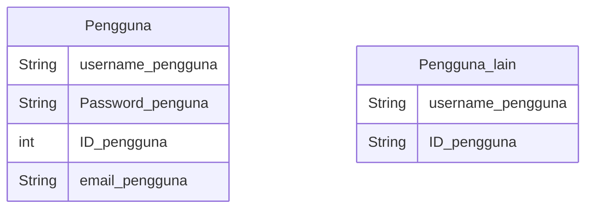

## 1.1 Latar Belakang

Pada masa sekarang ini Game sudah melekat pada sebagian besar manusia, dimana game sekarang  bukan hanya sebagai sarana hiburan akan tetapi juga sebagai Gaya hidup bahkan sebagian orang hidup dari penghasilan bermain game.Game Sin Frontera Dimana dengan latar belakang Abad pertengahan dalam dunia magis  yang memunculkan suasana,situasi,dan kondisi yang berubah ubah  menciptakan kemungkinan pengalaman bermain tak terbtas bagi para player dan membuat player merasakan game ini sebagai dunia "kedua" mereka.tujuan game ini dibuat untuk memuaskan para player bukan secara visual akan tetapi secara emosional dalam pemahaman karakter dan emosi yang meyakinkan.

## 1.2. Deksripsi Teknologi Informasi

Game ini dibuat dengan bertujuan untuk memberikan Pengalaman bermain yang sangat memuaskan bagi para player yang lebih khusunya lebih menyukai tipe RPG, game Story dan Strategic game , Game ini di usahakan akan bertema open world dalam game ada banyak class dan subclass yang dapat langsung di akses oleh palyer dan juga ada beberapa class yang memerlukan syarat khusus ,dimana setiap class memiliki fungsi,skill,gameplay,dan tujuan yang berbeda beda ,ini menciptakan pengalaman bermain bagi player yang sangat memukau dimana setiap player dapat memiliki classs dan sub class membuat banyak sekali kemungkinan gameplay  dengan mengkombinasikan class atau skill yang berbeda beda.
## 1.3. Branding
Branding :
- Merk        : Sin frontera
- Tagline     : Ubah dunia dari Keyboardmu
- Campaign    : Aplikasi yang membuat pengguna mudah dalam belajar coding , bertanya seputar coding dan dan Mendiskusikannya. 

Target user:
- Usia 12+(Siapapun, tapi di bawah umur itu perlu pengawasan orang tua)
- Siapa saja yang ingin belajar Coding
- Orang yang ingin membagikan ilmunya
- Orang yang ingin mempromosikan hasil codingannya.

User excperience :
- Mudah saling membantu
- sederhana
- tema gelap

## 2. User Story

Sebagai | Saya ingin bisa | Sehingga | Prioritas
---|---|---|---
| Pengguna | Bertanya tentang error kodingan saya | Ada interaksi dengan pengguna lain  | ⭐⭐⭐⭐⭐
| Pengguna | Mencari teman baru | bisa mendiskusikan sebuah permasalahan  | ⭐⭐⭐
| Pengguna | Membagikan ilmu dan pengalaman saya | Orang lain dapat beajar hal-hal baru | ⭐⭐⭐⭐⭐
| Pengguna | Membantu orang  lain dalam menyelesaikan permasalahan | Orang lain terbantu | ⭐⭐⭐⭐

## 3. Struktur Data

Cara membuat aneka macam bentuk grafik menggunakan mermaid.js bisa lihat di [https://mermaid.js.org/syntax/entityRelationshipDiagram.html](https://mermaid.js.org/syntax/entityRelationshipDiagram.html) 

## 4. Arsitektur Sistem

Masih pake mermaid.js juga bisa lihat flowchart di [https://mermaid.js.org/syntax/flowchart.html](https://mermaid.js.org/syntax/flowchart.html)

## 5. Teknologi, Library, dan Framework

bla bla bla

## 6. Desain User Experience dan User Interface

Bisa load image 

## 7. Demonstrasi Video

Link youtube nya

## 8. Bagaimana mesin komputasi dan sistem operasi berperan dalam produk teknologi informasimu ?

Link youtube nya di detik jawaban ini

## 9. Bagaimana algoritma, struktur data, dan bahasa pemrograman berperan dalam produk teknologi informasimu ?

Link youtube nya di detik jawaban ini

## 10. Bagaimana metode pengembangan perangkat lunak / Software Development Life Cycle berperan dalam produk teknologi informasimu ?

Link youtube nya di detik jawaban ini

## 11. Bagaimana database / sistem basis data berperan dalam produk teknologi informasimu ?

Link youtube nya di detik jawaban ini
