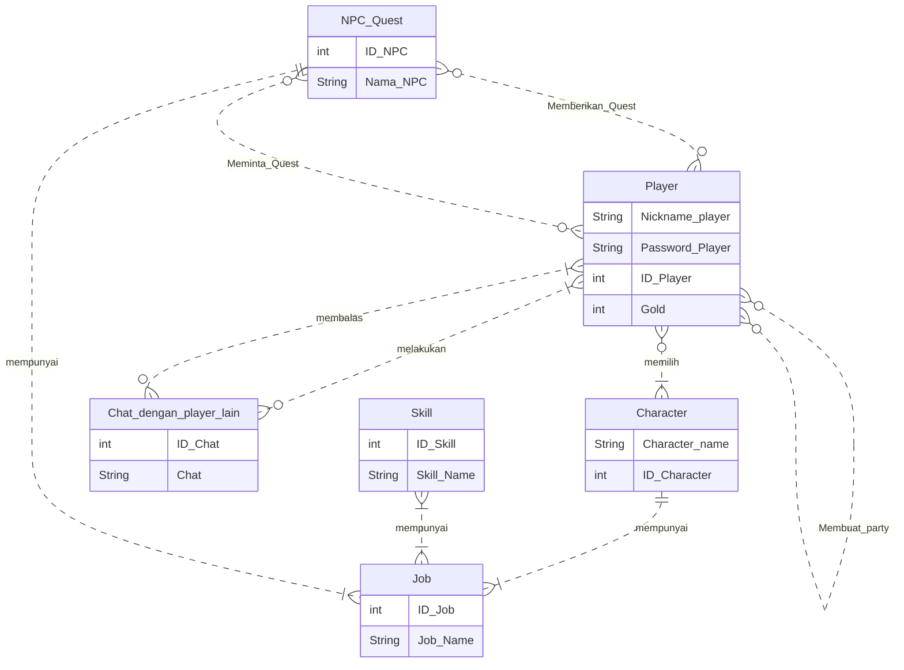

## 1.1 Latar Belakang

Pada masa sekarang ini Game sudah melekat pada sebagian besar manusia, dimana game sekarang  bukan hanya sebagai sarana hiburan akan tetapi juga sebagai Gaya hidup bahkan sebagian orang hidup dari penghasilan bermain game.CONTOHNYA Dungeons & Dragons (D&D) dianggap sebagai permainan RPG (Role-Playing Game) pertama di dunia. D&D pertama kali diterbitkan pada 1974 oleh Gary Gygax dan Dave Arneson.Saya membuat Game Sin Frontera Dimana dengan latar belakang Abad pertengahan dalam dunia magis yang memunculkan suasana,situasi,dan kondisi yang berubah-ubah menciptakan kemungkinan pengalaman bermain tak terbtas bagi para player dan membuat player merasakan game ini sebagai dunia "kedua" mereka.tujuan game ini dibuat untuk memuaskan para player bukan secara visual akan tetapi secara emosional dalam pemahaman karakter dan emosi yang meyakinkan.

## 1.2. Deksripsi Teknologi Informasi

Game ini dibuat dengan bertujuan untuk memberikan Pengalaman bermain yang sangat memuaskan bagi para player yang lebih khusunya lebih menyukai tipe RPG, game Story dan Strategic game , Game ini di usahakan akan bertema open world dan dalam game ada banyak class dan subclass yang bisa didapatkan character yang bisa langsung di akses oleh palyer dan juga ada beberapa class yang memerlukan syarat khusus ,dimana setiap class memiliki fungsi,skill,gameplay,dan tujuan yang berbeda beda ,ini menciptakan pengalaman bermain bagi player yang sangat memukau dimana setiap player dapat memiliki class dan sub class membuat banyak sekali kemungkinan gameplay  dengan mengkombinasikan class atau skill yang berbeda beda.
## 1.3. Branding
Branding :
- Merk        : Sin fronteras
- Tagline     : expand yout limits
- Campaign    : Menghadirkan Game RPG dengan Gameplay menarik dan unik,bukan hanya secara visual akan tetapi juga secara emosi Player dan                 gameplay

Target user:
- Usia 12+
- para player game yang mencari gameplay yang unik 
  

User excperience :
- sederhana tapi juga rumit
- tema game yang bersemangat
- sangat memerlukan strategy

Referensi:

## 2. User Story

Sebagai | Saya ingin bisa | Sehingga | Prioritas
---|---|---|---
| Pengguna | Mulai permainan | Permainan bisa dimulai  | ⭐⭐⭐⭐⭐
| Pengguna | Desain karakter |  Bisa memiliki desain karakter yang beragam | ⭐⭐⭐
| Pengguna | Menjelajahi map | Bisa mengexplore semua peta yang ada dalam game ini | ⭐⭐⭐⭐
| Pengguna | Mendapat quest | Bisa menyelesaikan quest dan mendapat hadiah | ⭐⭐⭐⭐⭐
| Pengguna | Karakter bisa melakukan interaksi dengan NPC | Bisa berinteraksi dengan NPC dalam mengambil quest atau hadiah | ⭐⭐⭐⭐⭐
| Pengguna | Melawan Mob  | bisa melakukan pertarungan dengan mob/monster dalam game | ⭐⭐⭐⭐⭐
| Pengguna | Mempunyai stat | Setiap karakter memiliki setiap aspek kekuatan yang berbeda tergantung stat karakter yang dimiliki   | ⭐⭐⭐⭐⭐
| Pengguna |  Mempunyai Class | Player bisa memilih Class tertentu untuk karakternya | ⭐⭐⭐⭐
| Pengguna | Mempunyai skill  | Setiap class/job memiliki skill yang berbeda | ⭐⭐⭐⭐⭐
| Pengguna | Mendapat item  | Bisa mendapatkan item setelah melawan monster atau setelah menyelesaikan quest | ⭐⭐⭐⭐⭐
| Pengguna |  berteman dengan player lain | Bisa berteman dengan player lain | ⭐⭐⭐⭐
| Pengguna | Melakukan PvP  | Bisa bertarung dengan player lain  | ⭐⭐⭐⭐⭐
| Pengguna |   |  | ⭐⭐⭐⭐⭐
| Pengguna |   |  | ⭐⭐⭐⭐⭐
| Pengguna |   |  | ⭐⭐⭐⭐⭐

## 3. Struktur Data

Cara membuat aneka macam bentuk grafik menggunakan mermaid.js bisa lihat di [https://mermaid.js.org/syntax/entityRelationshipDiagram.html](https://mermaid.js.org/syntax/entityRelationshipDiagram.html) 

## 4. Arsitektur Sistem

Masih pake mermaid.js juga bisa lihat flowchart di [https://mermaid.js.org/syntax/flowchart.html](https://mermaid.js.org/syntax/flowchart.html)

## 5. Teknologi, Library, dan Framework

bla bla bla

## 6. Desain User Experience dan User Interface

Bisa load image 

## 7. Demonstrasi Video

Link youtube nya

## 8. Bagaimana mesin komputasi dan sistem operasi berperan dalam produk teknologi informasimu ?

Link youtube nya di detik jawaban ini

## 9. Bagaimana algoritma, struktur data, dan bahasa pemrograman berperan dalam produk teknologi informasimu ?

Link youtube nya di detik jawaban ini

## 10. Bagaimana metode pengembangan perangkat lunak / Software Development Life Cycle berperan dalam produk teknologi informasimu ?

Link youtube nya di detik jawaban ini

## 11. Bagaimana database / sistem basis data berperan dalam produk teknologi informasimu ?

Link youtube nya di detik jawaban ini
