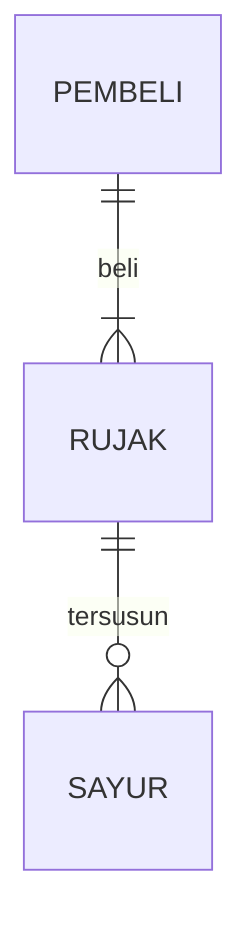

## 1.1 Latar Belakang

Pada masa sekarang ini banyak sekali orang orang yang ingin belajar tentang dunia coding akan tetap bingung harus mulai dari mana , harus pakai apa dan bagaimana cara melakukannnya. Biasanya orang orang yang belajar otodidak akan mengalami kesultan saat menemui masalah seperti code salah , ada code yang kurang atau hal hal lainya bingung harus melakukan apa ,bertanya pada siapa dan harus mencari referensi dari mana. hal hal tersebut akan menjadi penghambat bagi orang orang yang belajar secara otodidak hal itu akan dipermudah dengan menggunakan aplikasi ini.

## 1.2. Deksripsi Teknologi Informasi

Tujuan aplikasi Diacode ini dibuat untuk mempermudah pengguna dalam belajar seputar dunia coding, dimana dalam aplikasi ini pengguna dapat membuat forum, diskusi dan saling tanya jawab tentang hal hal spesfik, misalnya tentang web development , penggua dapat membuat forum khusus untuk membahas hal hal yang terkait dengan web development ,pengguna bisa saling mengikuti ,saling tanya jawab ataupun berbagi ilmu secara langsung dalam forum forum tersebut.

## 1.3. Branding

Merk        : DiaCode

Tagline     : Ubah dunia dari Keyboardmu

Campaign    : Aplikasi yang membuat pengguna mudah dalam belajar coding , bertanya seputar coding dan dan Mendiskusikannya. 

## 2. User Story

bla | bla | bla | bla
---|---|---|---
bla | bla | bla | ⭐⭐⭐⭐⭐

## 3. Struktur Data

Cara membuat aneka macam bentuk grafik menggunakan mermaid.js bisa lihat di [https://mermaid.js.org/syntax/entityRelationshipDiagram.html](https://mermaid.js.org/syntax/entityRelationshipDiagram.html) 

## 4. Arsitektur Sistem

Masih pake mermaid.js juga bisa lihat flowchart di [https://mermaid.js.org/syntax/flowchart.html](https://mermaid.js.org/syntax/flowchart.html)

## 5. Teknologi, Library, dan Framework

bla bla bla

## 6. Desain User Experience dan User Interface

Bisa load image 

## 7. Demonstrasi Video

Link youtube nya

## 8. Bagaimana mesin komputasi dan sistem operasi berperan dalam produk teknologi informasimu ?

Link youtube nya di detik jawaban ini

## 9. Bagaimana algoritma, struktur data, dan bahasa pemrograman berperan dalam produk teknologi informasimu ?

Link youtube nya di detik jawaban ini

## 10. Bagaimana metode pengembangan perangkat lunak / Software Development Life Cycle berperan dalam produk teknologi informasimu ?

Link youtube nya di detik jawaban ini

## 11. Bagaimana database / sistem basis data berperan dalam produk teknologi informasimu ?

Link youtube nya di detik jawaban ini
